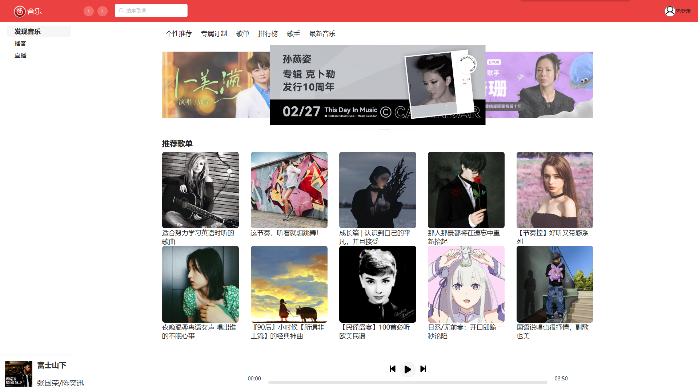
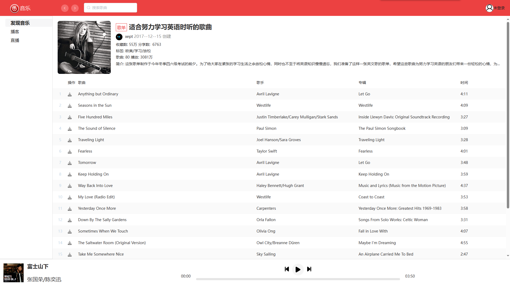
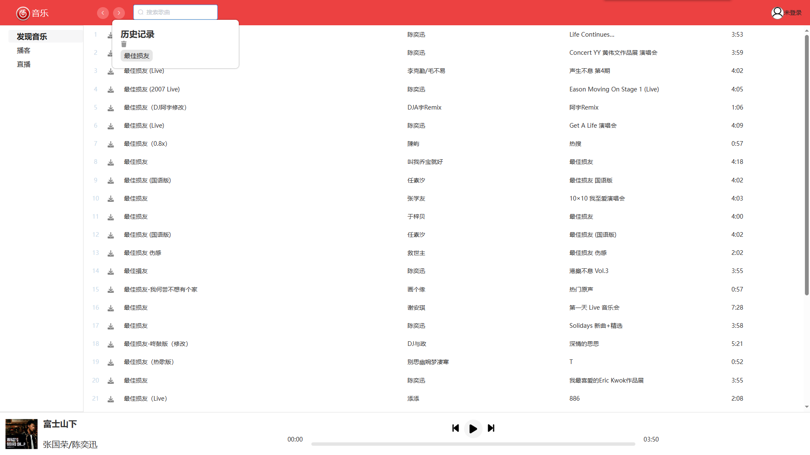

# 个人音乐客户端

一个音乐播放网站，支持用户搜索歌曲、查看歌单，以及播放网易云的非会员歌曲

## 页面展示







## 项目启动

### 启动服务器

在启动本项目前，需要先在本地启动后端服务器

> 本项目后端使用的是开源的网易云音乐 NodeJS 版，该项目现已下架

> 后端网盘链接:链接：https://pan.baidu.com/s/1RcDbnaA8MmLuiJ6p24F1mw 提取码：a7jo

在根目录下执行 app.js

```sh
# 启动本地服务器
node app.js
```

在看到 `server running @ http://localhost:3000` 表示服务器启动成功

接下来可以启动本项目

### 开发

将代码克隆到本地后

```sh
# 安装项目依赖
npm install
```

```sh
# 以开发模式运行
npm run serve
```

### 部署

```sh
# 安装项目依赖
npm install
```

```sh
# 打包项目
npm run build
```

## 项目简介

本项目使用 `Vue` 作为技术栈，基于 `webpack`，实现了 web 端音乐引用的部分功能

## 项目特点

-   依赖较少

    本项目仅引入了一些基本的开发依赖，提升项目的流畅性。

-   定制音频播放组件

    音频播放组件是播放音乐的核心功能之一，本项目采用自主开发的音频播放组件代替浏览器自带的音频播放组件，提升用户体验。
